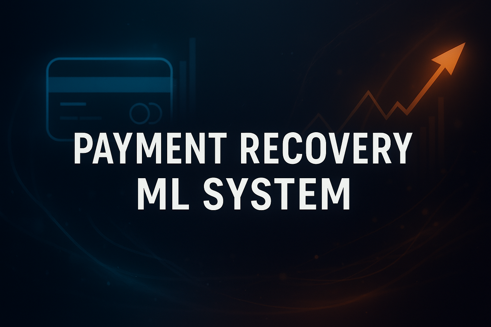

<p align="center">
  
</p>

<p align="center">
  
  
  
  
  
</p>


# Payment Recovery Prediction (ML + SQL + Streamlit)

An end-to-end machine learning project that predicts which **failed or unpaid transactions** will be recovered within **30 days**, and prioritizes outreach based on **expected recovered revenue** (amount × probability).  
Built fully from scratch using **Python**, **SQL**, **PostgreSQL**, **scikit-learn**, and **Streamlit**.

## Table of Contents
- [Project Highlights](#project-highlights)
- [Business Impact](#business-impact)
- [Tech Stack](#tech-stack)
- [Project Structure](#project-structure)
- [Data Model](#data-model-postgresql)
- [Machine Learning Pipeline](#machine-learning-pipeline)
- [Scoring Pipeline](#scoring-pipeline--expected-value-approach)
- [Streamlit App](#streamlit-app)
- [Run Locally](#run-locally)
- [Live Demo](#live-demo-streamlit)
- [Future Enhancements](#future-enhancements)
- [Contact](#contact)


##  Project Highlights

- **ML model:** Calibrated Logistic Regression  
- **Metrics:** PR AUC, Brier Score, Lift (Top-K vs overall)  
- **Feature engineering:** customer history, retries, timestamps, device, provider, country  
- **Expected value ranking:** maximize revenue, not raw probability  
- **SQL pipeline:** raw → staging → feature view (PostgreSQL)  
- **Reproducible:** Conda environment + modular Python scripts  
- **Interactive UI:** Streamlit app for real-time scoring & prioritization

##  Business Impact

This project simulates a real-world payment operations workflow where thousands of failed
credit card payments must be analyzed and prioritized manually. The model provides
significant operational and financial benefits:

###  Operational Benefits
- **Automates** the prioritization of failed payments  
- **Reduces manual effort** for finance & billing teams  
- **Provides transparency** into probability and expected value of recovery  
- **Supports better decision-making** with a data-driven scoring system  

###  Financial Benefits
- Focuses outreach on customers **most likely to pay**
- Uses **expected recovered value (amount × probability)** to maximize revenue
- Improves **cash flow predictability**
- Helps reduce **DSO (Days Sales Outstanding)**

###  Measured Results
Using the synthetic dataset and calibrated logistic regression:

- **Higher expected recovered value per call**  
- **Better calibration → more reliable probability estimates**

## Tech Stack

**Languages & Core**  
Python, SQL

**Data & ML**  
Pandas, NumPy, scikit-learn

**Database**  
PostgreSQL, psycopg2

**App**  
Streamlit

**Dev Tools**  
Git, Conda, Jupyter

## Project Structure

```
payment-recovery-ml/
├── app/
│   └── streamlit_app.py
├── data/
│   └── sample_feature_view.csv
├── models/
│   └── model_calibrated.joblib
├── notebooks/
├── sql/
│   ├── 01_schema.sql
│   ├── 02_staging.sql
│   └── 03_feature_view.sql
├── train_from_scratch.py
├── score_from_scratch.py
├── environment.yml
└── README.md
```

## Data Model (PostgreSQL)

The project uses a 3-layer SQL design:

### **Raw Layer**  
Stores synthetic transactions: provider, device, timestamps, retries, country, payment_date.

### **Staging Layer**  
Cleans data, fixes timestamps, and assigns the binary label:
```
label_recovered_30d = payment_date <= invoice_date + 30 days
```

### **Feature View**  
Window functions generate:  
customer history, amount bucket, days since invoice, days since last event, retries, provider, device, country, and more.

## Machine Learning Pipeline

- Temporal split (train vs test)  
- Preprocessing (scaling + one-hot encoding)  
- Logistic Regression (balanced)  
- Probability calibration  
- PR AUC + Brier Score evaluation  
- Saves: `model_calibrated.joblib`

## Scoring Pipeline — Expected Value Approach

Instead of sorting only by probability:

```
ev_recovered = amount × p_recover_30d
```

This ranks invoices by **maximum revenue recovery** potential.

Exports:  
- recovery probability  
- expected recovered revenue  
- top-K prioritization  
- timestamped CSV  

## Streamlit App

Features:  
- Upload CSV or load from Postgres  
- Score invoices  
- View KPIs  
- Prioritize by expected value  
- Download results  

## Run Locally

```
conda env create -f environment.yml
conda activate payrec-ml

python train_from_scratch.py
python score_from_scratch.py

streamlit run app/streamlit_app.py
```
## Live Demo (Streamlit)

 **https://payment-recovery-ml.streamlit.app**

<p align="center">
  
</p>

Upload a CSV exported from your `v_feature_view` (or use the included sample file) to:

- score unpaid invoices  
- compute expected recovered revenue  
- see predicted 30-day recovery probability  
- and prioritize outreach based on business impact
  
## Future Enhancements

- XGBoost model  
- SHAP explanations  
- Automated ETL & batch scoring  
- Writebacks to Postgres  
- Monitoring & alerting  
- CI/CD integration

---

##  Contact

If you’d like to connect, collaborate, or discuss data/ML roles:

- **GitHub:** https://github.com/negroniO  
- **LinkedIn:** https://www.linkedin.com/in/george-iordanous 

---

If you found this project useful, consider leaving a ⭐ on the repo!

